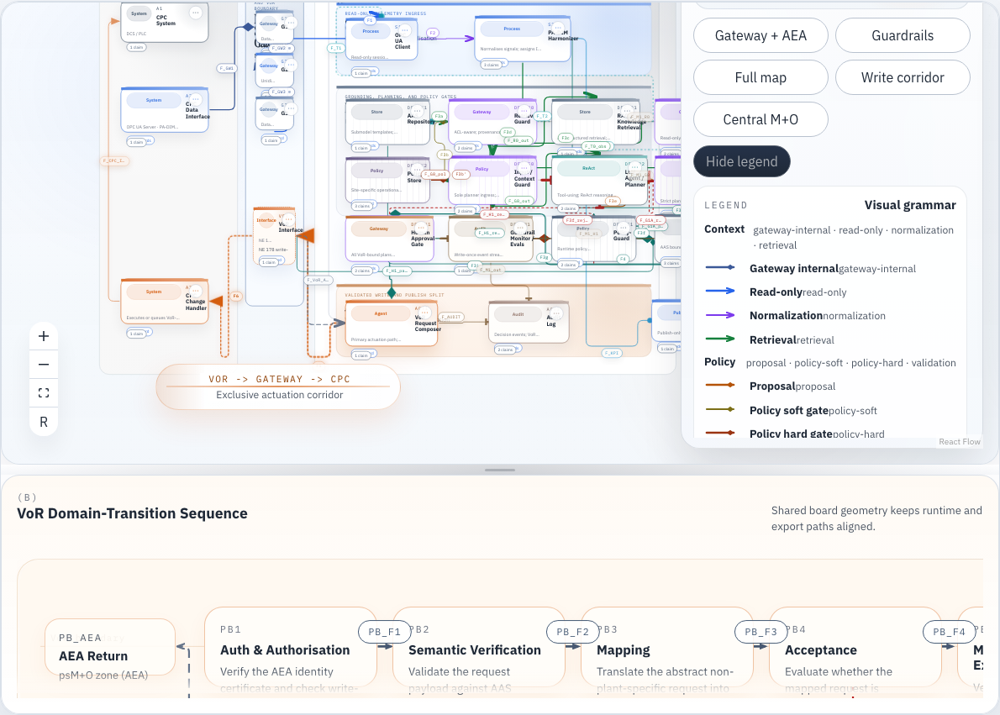
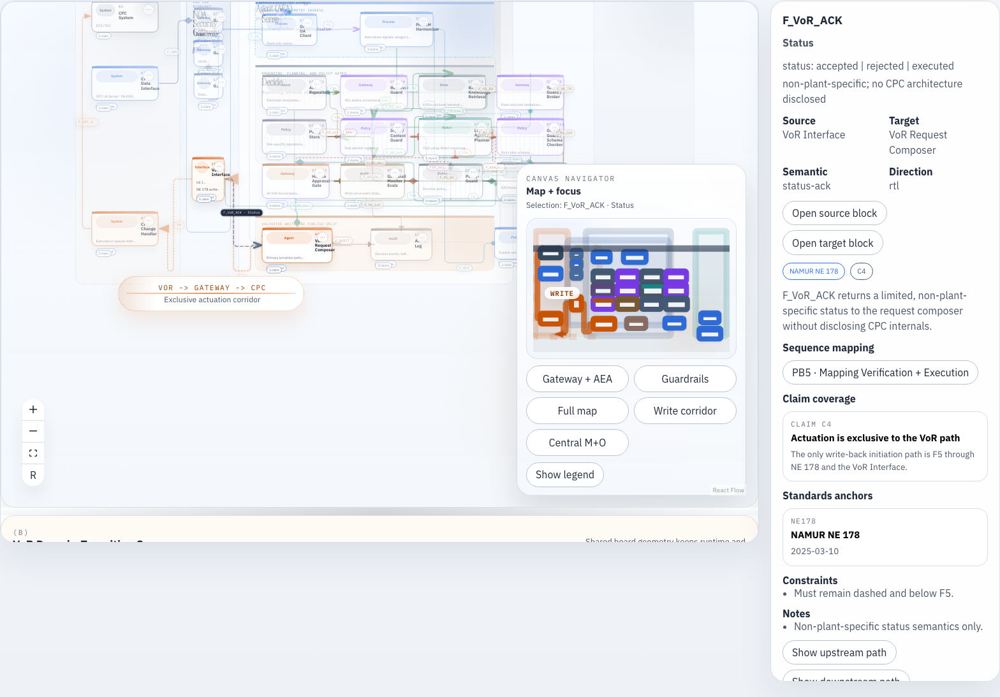

# AEA Architecture

Interactive React application for exploring the AEA architecture figure as an audited graph, a publication-oriented canvas, and a synchronized VoR sequence view. The repository is built around a spec-locked model: the semantics come from the master architecture specification, while the UI projects that model into inspectable, filterable, and exportable figure artifacts.

This project is optimized for two audiences at once. External readers can use it to understand the architecture, standards anchors, and writeback constraints; contributors can use it to inspect the runtime manifest, validate invariants, and iterate on layout or presentation without changing the underlying semantics.



*Panel A overview with the navigator, legend, and synchronized sequence panel visible. The canvas renders the canonical architecture board, not an ad hoc diagram authored directly in React Flow.*

## What This App Does

- Projects the AEA figure specification into a canonical runtime graph with 36 nodes, 51 edges, 5 sequence steps, 6 architectural claims, and 17 standards anchors.
- Renders Panel A as an interactive architecture canvas spanning CPC, plant-specific M+O, and central M+O domains.
- Renders Panel B as a synchronized VoR domain-transition sequence tied to the same graph model.
- Lets readers search nodes, edges, claims, standards, and sequence steps, then inspect the semantic and standards context for each selection.
- Exports figure artifacts from the same runtime model used in the browser: SVG, PDF, Mermaid, raw graph JSON, and projection JSON.

## What The Figure Must Prove

The figure is not a generic system map. It exists to make six architecture claims inspectable in a single reading.

| Claim | Meaning in the app |
| --- | --- |
| `C1` | The autonomous agent remains in the NOA M+O domain and never executes inside CPC. |
| `C2` | Sensing is read-only and crosses the CPC boundary through the NE 177 diode-style ingress chain. |
| `C3` | Decision-making is grounded in PA-DIM, AAS, retrieval controls, schema enforcement, deterministic validation, and approval gates before any VoR request can be emitted. |
| `C4` | Actuation is exclusive to the VoR writeback path; there is no alternate direct write channel into CPC. |
| `C5` | KPI publication is northbound, publish-only, and intentionally decoupled from actuation. |
| `C6` | AI safety controls are deterministic and external to the model rather than prompt-only conventions. |

These claims are defined in the runtime manifest and linked throughout the UI via chips, inspector panels, edge mappings, and export outputs.

## Architecture Model

The application mirrors a two-panel journal figure.

- **Panel A** is the static architecture board. It spans three swimlanes: Core Process Control (CPC / OT), plant-specific M+O at the edge, and central M+O off-prem.
- **Panel B** is the dynamic VoR domain-transition sequence. It elaborates the NE 178 execution path while staying synchronized with Panel A selections.
- The **NOA Security Gateway** sits between CPC and the agent domain, separating the NE 177 read-only ingress chain from the NE 178 VoR writeback interface.
- The **AEA bands** split the edge agent into Sense, Decide, and Act regions so readers can inspect ingestion, guardrails, and actuation as distinct concerns.

The model is intentionally spec-locked. Layout, filtering, focus, and author-mode projection are interactive. Semantic creation, deletion, or retargeting of nodes and edges is not.

## Source Of Truth

The repository separates semantic authority from runtime projection:

- [`docs/AEA_Figure_Specification.md`](docs/AEA_Figure_Specification.md) is the normative master specification for the figure.
- [`src/graph/spec/architecture.graph.json`](src/graph/spec/architecture.graph.json) is the audited structured mirror consumed by the application.
- [`src/graph/spec/manifest.ts`](src/graph/spec/manifest.ts) validates the graph JSON at startup and exposes typed runtime accessors.
- [`src/graph/spec/projection.defaults.json`](src/graph/spec/projection.defaults.json) stores presentation defaults such as panel state and layout-oriented projection settings.

In practical terms: the spec defines what the architecture means, the graph JSON makes it executable inside the app, and the projection layer controls how it is shown without changing what it says.

## Feature Walkthrough

### Search And Filtering

- Global search jumps directly to nodes, edges, standards, claims, and sequence steps.
- Path presets narrow the view to write, policy, telemetry, or full-graph corridors.
- Lane and semantic-family filters reduce the visible topology without mutating the underlying manifest.
- Claim chips and standard chips let you pivot the view around specific architectural assertions or external anchors.

### Explore And Author Modes

- **Explore mode** is the default reading mode for inspecting semantics, claims, and standards.
- **Author mode** is restricted to projection concerns such as layout adjustments and saved snapshots. It does not allow semantic editing.
- Theme, reduce-motion, viewport lock, and note expansion state are persisted in browser storage.

### Selection And Synchronization

- Selecting a node, edge, or sequence step updates the inspector with rationale, participation maps, standards anchors, and linked claims.
- Cross-panel mappings keep the architecture board and VoR sequence tied to the same runtime entities.
- Selecting architecture content with linked sequence steps auto-reveals Panel B at a readable split, so the corresponding VoR state is visible without manual resizing.
- Panel B keeps its split as a persisted percentage of the workspace height and uses its own scroll container on short viewports so the lower VoR terminals remain reachable.
- URL search params mirror the current selection and filter state, making focused views shareable and reproducible.



*Selected `F_VoR_ACK` acknowledgement state. The workspace view shows the architecture selection, the focused navigator region, the linked sequence mapping in the inspector, and the revealed VoR sequence panel below.*

### Snapshots And Exports

- Projection snapshots store named layout and presentation states for later recall.
- Export actions generate SVG and PDF in both viewport and publication modes.
- Mermaid exports exist for both the architecture topology and the VoR sequence topology.
- Raw `graph.json` and `projection.json` exports let you inspect the semantic model and current presentation state directly.

## Stack

- Vite
- React 19
- TypeScript
- React Flow (`@xyflow/react`)
- Zustand
- Zod
- Mermaid
- jsPDF + `svg2pdf.js`
- Vitest
- Playwright

## Quick Start

### Prerequisites

- Node.js
- npm

### Install And Run

```bash
npm install
npm run dev
```

By default Vite serves the app on `http://localhost:5173/`. If that port is busy, it will choose the next available port.

### Useful Commands

```bash
npm run dev        # start the local development server
npm run build      # type-check and build the production bundle
npm run typecheck  # run TypeScript project references
npm run lint       # run ESLint
npm run preview    # preview the production build locally
npm run test       # run Vitest
npm run test:e2e   # run Playwright end-to-end and visual regression coverage
```

## Testing And Validation

Use these commands as the baseline validation workflow:

```bash
npm run build
npm run test
```

The end-to-end suite is available separately:

```bash
npm run test:e2e
```

That Playwright suite covers interaction flows, keyboard accessibility, panel synchronization, and screenshot-based visual regression. Small screenshot diffs can be environment-sensitive; if failures are limited to snapshot comparisons, inspect the generated artifacts in `test-results/` before treating them as functional regressions.

Recent sequence-panel coverage specifically checks stale persisted splits, auto-opening from mapped architecture selections, and short-viewport scrolling inside Panel B.

## Repository Map

- [`docs/`](docs/) contains the master figure specification and supporting documentation assets.
- [`src/graph/spec/`](src/graph/spec/) contains the canonical graph JSON, schema, validators, and manifest access layer.
- [`src/graph/compile/`](src/graph/compile/) transforms the spec model into search indexes, React Flow entities, Mermaid output, SVG export data, and sequence models.
- [`src/ui/`](src/ui/) contains the canvas, controls, inspectors, nodes, and edges used to render the architecture and sequence views.
- [`src/state/`](src/state/) holds Zustand UI state, URL serialization, persistence, and projection behavior.
- [`src/test/`](src/test/) contains Vitest unit coverage and Playwright end-to-end coverage.

## Export Outputs

| Output | Purpose |
| --- | --- |
| `SVG viewport` | Captures the current visible board state for quick sharing or review. |
| `SVG publication` | Produces a publication-oriented vector export from the canonical model. |
| `PDF viewport` | Captures the currently visible state as PDF. |
| `PDF publication` | Produces a publication-style PDF export suitable for figure workflows. |
| `Mermaid topology (architecture)` | Emits a Mermaid version of Panel A. |
| `Mermaid topology (sequence)` | Emits a Mermaid version of Panel B. |
| `graph.json` | Exports the validated semantic graph manifest. |
| `projection.json` | Exports the current projection and presentation state. |

## Further Reading

- Full figure specification: [`docs/AEA_Figure_Specification.md`](docs/AEA_Figure_Specification.md)
- Infographic blueprint: [`docs/AEA_Infographic_Blueprint.md`](docs/AEA_Infographic_Blueprint.md)
- Canonical graph manifest: [`src/graph/spec/architecture.graph.json`](src/graph/spec/architecture.graph.json)
- Runtime manifest accessors: [`src/graph/spec/manifest.ts`](src/graph/spec/manifest.ts)

If you are changing layout or presentation behavior, start with the manifest and projection defaults first. If you are changing semantics, update the master specification and the graph mirror together so the app and the figure stay in sync.
